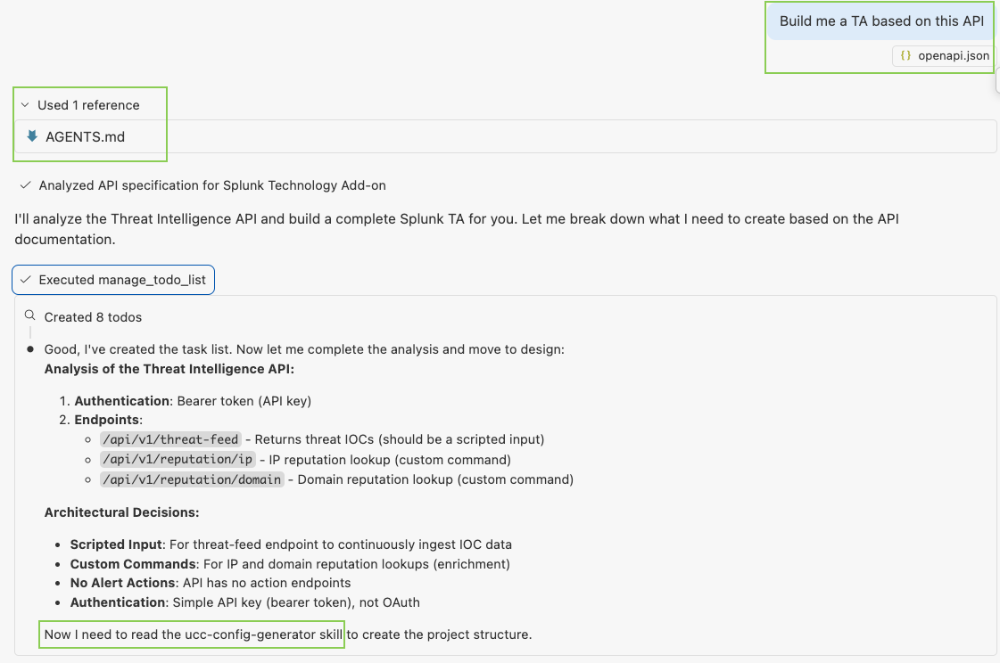

# Agentic Splunk TA Builder

This project provides an **agentic development framework** that enables you to generate complete, production-ready Splunk Technology Add-ons by simply describing your API to an LLM (like GitHub Copilot, Claude, or ChatGPT). No more manually writing boilerplate configuration files or setting up complex project structures—just provide your API documentation and let the AI build your TA.

## Purpose

Enable AI agents (like GitHub Copilot) to automatically generate production-ready Splunk TAs from API documentation using the UCC (Universal Configuration Console) framework.

### Key Features

- 🤖 **Conversational Development**: Chat with an LLM to build your TA—no complex tooling required
- 📋 **Configuration as Code**: Built on Splunk's UCC (Universal Configuration Console) framework
- 🎯 **Intelligent Architecture**: Automatically decides what components to build based on your API
- ✅ **AppInspect Ready**: Generates TAs that pass Splunk's validation requirements
- 📚 **Documentation Included**: Comes with auto-generated documentation
- 🧪 **Testing Built In**: Includes basic test suite structure
- 🚀 **Production Ready**: Creates installable packages ready for Splunkbase

## What Gets Built For You

When you provide API documentation, the agent analyzes it and automatically creates:

- **Scripted Inputs** - for endpoints that return events, logs, or time-series data
- **Custom SPL Commands** - for search/lookup endpoints that analysts need on-demand
- **Alert Actions** - for APIs that accept actions (tickets, notifications, remediation)
- **Configuration UI** - auto-generated from your specifications
- **Authentication Handling** - API keys, OAuth, basic auth, or custom patterns
- **Error Handling & Logging** - production-grade error management
- **Checkpointing** - for reliable, resumable data collection
- **Documentation** - setup guides, configuration examples, troubleshooting
- **Tests** - unit and integration test structures

## Key Components

### AGENTS.md
The main orchestration agent that:
- Analyzes API documentation
- Makes architectural decisions (scripted inputs, custom commands, alert actions)
- Coordinates specialized skills to build complete TAs
- Ensures AppInspect compliance

### Skills (`.github/skills/`)
Domain-specific knowledge modules that handle:
- **ucc-init**: Initializes UCC structure and creates the initial `globalConfig.json`
- **ucc-build-and-package**: Builds and packages the TA with UCC
- **splunk-modular-input**: Implements data collection logic
- **splunk-custom-command**: Creates custom SPL commands
- **generate-splunk-app-icons**: Generates app icon sets
- **splunk-appinspect**: Validates packages against Splunk standards
- **ucc-config-generator**: Deprecated legacy skill (do not use for new work)

## How It Works

1. Developer provides API documentation and add-on metadata
2. Agent analyzes API and decides components (inputs/commands/alerts)
3. `ucc-init` creates structure and baseline `globalConfig.json`
4. Specialized skills add inputs/commands, helper logic, and icons
5. `ucc-build-and-package` builds and packages the TA
6. `splunk-appinspect` validates the package for submission readiness

## Usage

Drop an openapi.json file into GH Copilot Chat in VS Code and ask it to build a Splunk TA based on that API.

## Requirements

- Python 3.9+
- `uv` (recommended) or `venv` for dependency isolation
- Access to Splunk AppInspect API (for validation)
